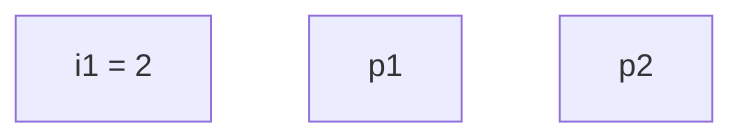
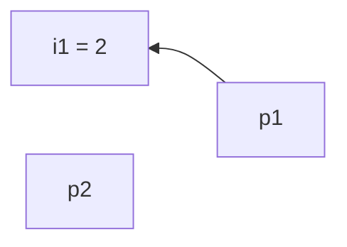
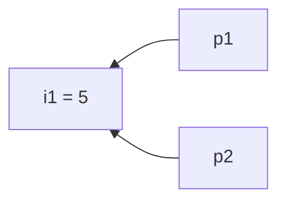
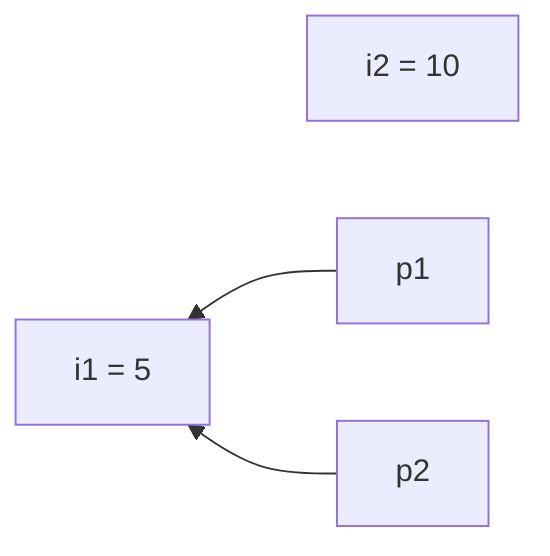
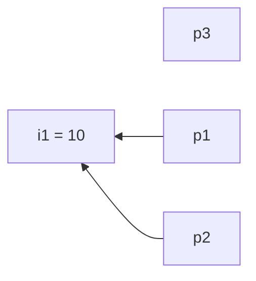
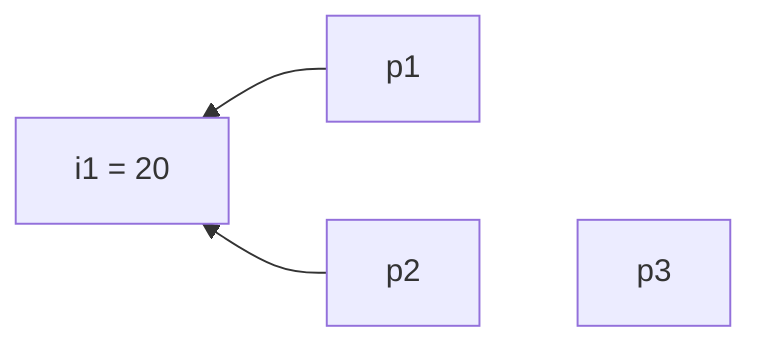

# Feladat 1

## 1.

```mermaid
graph LR
    i1[i1 = 2]
    i1 ~~~ p1 ~~~ p2
```

## 2.

```mermaid
graph RL
    i1[i1 = 2]
    p1 --> i1  
    p1 ~~~ p2
```

## 3.

```mermaid
graph RL
    i1[i1 = 5]
    p1 --> i1  
    p2 --> i1
```

## 4.

```mermaid
graph RL
    i1[i1 = 5]
    i2[i2 = 10]
    p1 --> i1  
    p2 --> i1
```

## 5.

```mermaid
graph RL
    i1[i1 = 10]
    p3 ~~~ i1
    p1 --> i1
    p2 --> i1
```

## 6.

```mermaid
graph RL
    i1[i1 = 20]
    p3 ~~~ p2
    p1 --> i1
    p2 --> i1
```